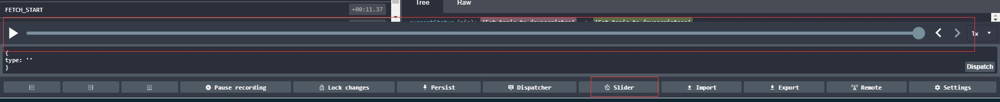
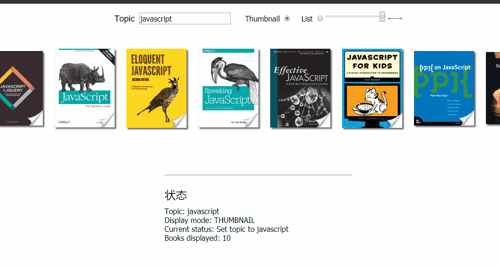

# redux 时间旅行，你值得拥有！

## 啥叫时间旅行？

顾名思义，就是可以随时穿越到以前和未来，让应用程序切换到任意时间的状态。我们都知道，一般应用状态都很复杂，创建、维护、修改和弄明白有哪些行为会影响状态都不是一件容易的事儿。

## redux 的解决方案

整个应用的 state 被储存在一棵 object tree 中，并且这个 object tree 只存在于唯一一个 store 中。并使用纯函数计算下一个应用程序状态（不允许其他途径对 state 进行修改）。这些特征使 Redux 成为了一个可预测 的状态容器，这意味着如果给定一个特定应用程序状态和一个特定操作，那么应用程序的下一个状态将始终完全相同。这种可预测性使得实现时间旅行变得很容易。redux 也相应的开发了一个带时间旅行的开发者工具[redux-devtools](https://github.com/reduxjs/redux-devtools)

就是上面这个东西。下面就让我们跟随例子一起来了解下 redux 时间旅行的工作原理。

## 阅读要求

> * react 基础
> * redux 基础，明白 action，reducer，state 的关系。明白 combineReducer 的原理。

## 开始

### 项目地址：(github)[https://github.com/wuyafeiJS/redux-timetravel]

预览：

既然我们要实现时间旅行，那么第一步我们需要一个对象来记录每一次状态：`stateHistory.js`

```js
export default {
  past: [],
  futrue: [],
  present: undefined,
  gotoState(i) {
    const index = i * 1;
    const allState = [...this.past, this.present, ...this.futrue];
    this.present = allState[index];
    this.past = allState.slice(0, index);
    this.futrue = allState.slice(index + 1, allState.length);
  }
};
```

我们把状态分为三个时间段：过去，现在（只有一个状态），将来。gotoState 函数则是用来做时间旅行的。

那么我们如何去存放每一次变更的状态呢？我们需要找到一个入口，这个入口必须是每次触发状态变更都会经过的地方。而触发状态变更唯一的方式就是`dispatch(action)`，想想，这样的地方好像只有一个地方,看过 redux 源码的同学肯定就是不陌生，那就是 combineReducer 生成的 reducers 纯函数。
combineReducer 负责整合多个 reducer，最终返回一个能够处理所有 action 的 reducers。让我们大致简单实现一下：

```js
const combineReducer = obj => (state, action) => {
  const finalState = {};
  for (key in obj) {
    finanlState[key] = obj[key](state[key], action);
  }
  return finalState; // 全局state
};
```

接下来，让我们利用函数式编程的思想加强下 reducers 的功能，让它能记录 state：`reducers.js`

```js
import stateHistory from './stateHistory';// 引入我们之前声明的history对象

// 原本我们是这样返回reducers的
export default combineReducers({
    books: fetchReducer,
    displayMode: bookDisplayReducer,
    currentStatus: statusReducer,
    topic: topicReducer
})
// 改造后如下：
export default history(
  combineReducers({
    books: fetchReducer,
    displayMode: bookDisplayReducer,
    currentStatus: statusReducer,
    topic: topicReducer
  })
);
// 我们用history包裹combineReducer,history实现如下
const history = reducers => (state, aciton) => {
  switch (action.type) {
    case 'UNDO': // 后退
      stateHistory.undo();
      break;
    case 'REDO': // 前进
      stateHistory.redo();
      break;
    case 'GOTO': // 定点指向
      stateHistory.gotoState(action.stateIndex);
      break;
    default:
      const newState = reducer(state, action);
      stateHistory.push(newState);// 每次dipatch(action)都会像将状态保存到stateHistory
  }
  return stateHistory.present; // 返回当前状态
}
```

完善下`stateHistory.js`

```js
export default {
  ...

  hasRecord(type) {// 查询是否有过去或者将来的状态
    return this[type].length > 0;
  },
  hasPresent() { // 查询是否有现在的状态
    return this.present !== undefined;
  },
  setPresent(state) {
    this.present = state;
  },
  movePresentToPast() {
    this.past.push(this.present);
  },
  push(currentState) { // 将状态都保存，并更新当前状态
    if (this.hasPresent()) {
      this.past.push(this.present);
    }
    this.setPresent(currentState);
  },
  getIndex() { // 获取当前状态index
    return this.past.length;
  },
  undo() { // 后退
    if (this.hasRecord('past')) {
      this.gotoState(this.getIndex() - 1);
    }
  },
  redo() { // 前进
    if (this.hasRecord('futrue')) {
      this.gotoState(this.getIndex() + 1);
    }
  },
  ...
};
```

配置 action:`actions.js`

```js
...
export const redo = () => ({
  type: 'REDO'
});

export const undo = () => ({
  type: 'UNDO'
});

export const gotoState = stateIndex => ({
  type: 'GOTO',
  stateIndex
});
```

准备工作都已经做完，接下来咱们直接在 react 组件内加上触发代码即可`components/History.js`

```js
const History = ({ past, futrue, present, redo, undo, gotoState }) => {
  const styles = {
    container: {
      marginLeft: '20px',
      cursor: 'pointer'
    },

    link: { textDecoration: 'none' },
    input: { cursor: 'pointer' }
  };
  const RightArrow = () => (
    // 前进
    <a href="#" style={styles.link} onClick={() => redo()}>
      &#8594;
    </a>
  );

  const LeftArrow = () => (
    // 后退
    <a href="#" style={styles.link} onClick={() => undo()}>
      &#8592;
    </a>
  );
  const max = () =>
    (past ? past.length : 0) +
    (present ? 1 : 0) +
    (futrue ? futrue.length : 0) -
    1;
  const value = () => (past ? past.length : 0);
  return (
    <span>
      <input
        type="range"
        min={0}
        max={max()}
        value={value()}
        onChange={e => {
          gotoState(e.target.value);
        }}
        style={styles.input}
      />
      {past && past.length > 0 ? <LeftArrow /> : null}
      {futrue && futrue.length > 0 ? <RightArrow /> : null}
    </span>
  );
};
```

以上！希望对大家理解 redux 有所帮助。
